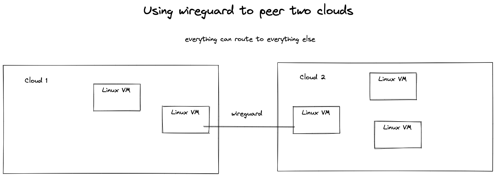

# cross-cloud-vpn-firewall

This repo deploys 2 (simple) cloud environments and connects them with a Wireguard VPN.

Sources
1. https://tailscale.com/blog/how-nat-traversal-works/
2. https://github.com/facebookincubator/katran
3. https://www.wireguard.com/
4. https://dev.to/stack-labs/introduction-to-taskfile-a-makefile-alternative-h92
5. https://github.com/mina-alber/wireguard-ansible/blob/master/tasks/main.yml
6. https://stackoverflow.com/questions/40086613/ansible-jinja2-string-comparison # "You don't need quotes and braces to refer to variables inside expressions"
7. https://docs.ansible.com/ansible/latest/user_guide/playbooks_vars_facts.html
8. https://github.com/tommywalkie/excalidraw-cli
